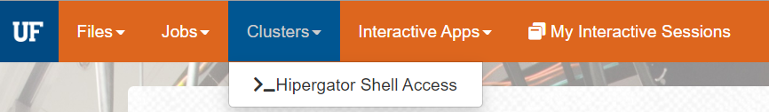
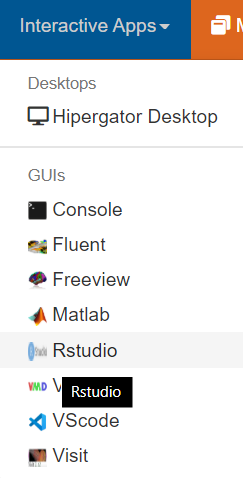
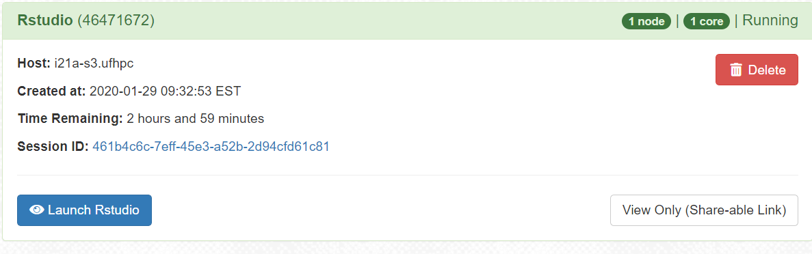
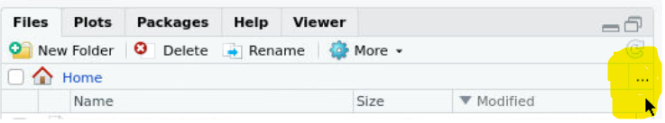
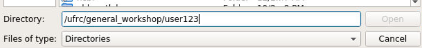
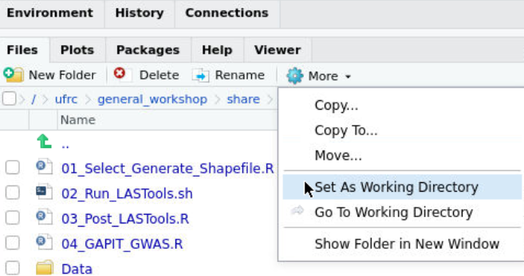
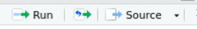
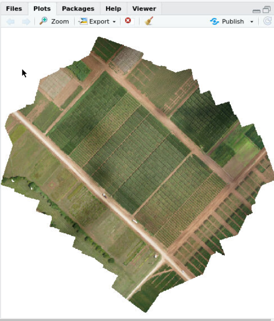
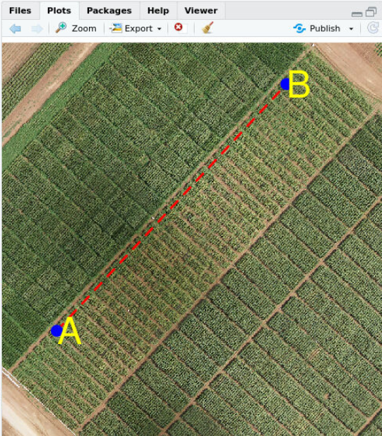
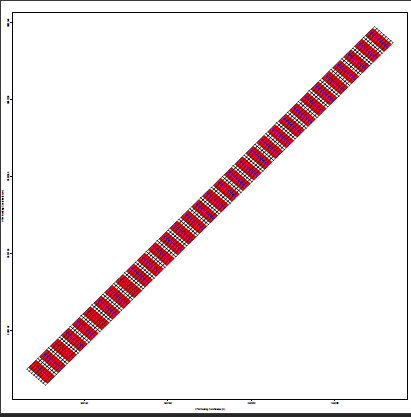

# Workshop Hands-On

The Workshop makes use of the University of Florida's [HiPerGator](https://rc.ufl.edu) computer cluster. The computational requirements for analyzing the examples are not large and could be done on your own computer. However, we do skip a few steps and processing many files is often best done on a computer cluster. If you run this on your own computer, you will need to install the R libraries and [LASTools](http://lastools.org/) software on your computer and adjust paths. We have tried to use relative paths as much as possible, though some paths will need to be updated.

For the workshop, each user will use a temporary account to access HiPerGator resources. You will be given a slip of paper with the username and password to use. Even if you have your own HiPerGator account, it would be best to use the one for the workshop to ensure that you have access to some of the files and applications stored in the workshop folder. The temporary accounts will be deleted shortly after the workshop.

## Step 1: Login to Open On Demand
For the workshop, we will be using the Open-on-Demand interface to get a terminal window and a Rstudio window as we work through the exercises.

In your web browser, go to https://ood.rc.ufl.edu/ 
**Note:** You need to be on the UF network to reach this site. Please use the eduroam WiFi network or connect with UF VPN.

Hopefully we won't need this...

When you get to the GatorLink login screen, **log in with the temporary account provided to you**. Do not login with your own GatorLink account as you will not have access to the needed resources.

> **Hopefully we don't need this section:** It may be the case OOD becomes overloaded during the workshop, if that happens, [here is another method that will connect you to Rstudio](https://help.rc.ufl.edu/doc/GUI_Programs#RC_GUI-2.0). The commands needed would be  `module load gui/2; gui start -e rstudio -c 1 -m 2 -t 2` and `gui show` to get the connection URL.

## Step 2: Use shell to clone repository

From the Clusters menu, select HiPerGator Shell Access


This will open a new window with a Linux terminal on HiPerGator. 

For this step, we will use some Linux commands to make a clone of this repository in your directory on the cluster.

Users should store data in their /ufrc directory, so the first thing to do is change directories from your home directory to your /ufrc directory located at `/ufrc/general_workshop/gatorlink` (replace *gatorlink* with your temporary GatorLink account name, in the documentation here, I'll use user123).

Once in your user's /ufrc/general_workshop directory, clone this repository. Here are the commands to use for these steps.

```bash
[user123@login1 ~]$ cd /ufrc/general_workshop/user123/
[user123@login1 user123]$ git clone https://github.com/UFResearchComputing/PlantSci_BigData.git
Cloning into 'PlantSci_BigData'...
remote: Enumerating objects: 30, done.
remote: Counting objects: 100% (30/30), done.
remote: Compressing objects: 100% (21/21), done.
remote: Total 269 (delta 11), reused 24 (delta 9), pack-reused 239
Receiving objects: 100% (269/269), 85.19 MiB | 5.33 MiB/s, done.
Resolving deltas: 100% (105/105), done.
[user123@login1 user123]$ 
```

## Step 3: Open Rstudio

Now that we have a copy of the files for the workshop in your /ufrc/general_workshop directory, we can launch Rstudio and start working with the data.

Go back to the main OOD tab (leave the terminal open, we'll use this later).

From the Interactive Apps menu, select Rstudio. 

The screen that comes up after that allows you to select the resources needed for your Rstudio session. This is one way to schedule a job on the cluster and allows you to tell the SLURM scheduler information about the processors (CPUs), memory, time and other information about your job. 

**For our purposes, you can leave this with the default settings and scroll all the way to the botton and click Launch.**

That will submit your job to the scheduler and wait for it to start up. Wait a minute or so and the box should look something like this, with a **Launch Rstudio** button. 

This will open a new browser window with Rstudio running on the cluster. This allows you to run a graphical, interactive Rstudio session, using the storage and compute resources of HiPerGator.

## Step 4: Load 01_Select_Generate_Shapefile.R

Now that we have Rstudio running, we need to open the first script from the repository we cloned in step 2 above.

In the right-hand side of the Files section of Rstudio, click on the three dots (highlighted in screenshot).  

In the Directories box at the bottom of the window, type in /ufrc/general_workshop/gatorlink, using your temporary gatorlink id. 

The file is in PlantSci_BigData/Workshop/01_Select_Generate_Shapefile.R

Once the file is open, set this folder (/ufrc/general_workshop/user123/PlantSci_BigData/Workshop) as the working directory for R using the Gear More menu in the Files pane and selecting Set Working Directory.


Now that the 01_Select_Generate_Shapefile.R script is loaded and the working directory is set to`/ufrc/general_workshop/user123/PlantSci_BigData/Workshop`, we can start stepping through it. **Note** this pipeline is somewhat interactive, and it is best to select lines or click on individual lines and click the Run button to execute those lines. 

## Step 5: Running lines of the script

### 5a: Load the libraries

Select the `library()` lines and click Run to load all the libraries. If you get errors about missing libraries, run `install.packages('')` with the name of the missing library in the quotes.


### 5b: Load the image of the field

Lines 17-20:
```R
#mosaic<-stack("Data/20180622_cs_sony_corn_mosaic.tif") # Use this line if your download the tif file to Data dir.
mosaic<-stack("/ufrc/general_workshop/share/Large_files/20180622_cs_sony_corn_mosaic.tif") # Comment out if you get the tif file
plotRGB(mosaic, r = 1, g = 2, b = 3)
```


These lines load the image of the corn field and display it. The image file is not part of the github repo because it is too large. You should download the image and place it in the Data folder of your clone of the repository.

Run these lines and the image should display in the Plots window.

### 5c: Select the bounding box for the field of interest

Lines 22-29
```R
######### Creating field mask polygon to clip pointcloud. ######### 
field_mask<-data.frame()
for (i in 1:4){
  x<-locator(type = "p",n=1,col="red",pch=19)
  field_mask<-rbind(field_mask,x)
}

field_mask<-rbind(field_mask,field_mask[1,])
```

When you run these lines, you click in the image to select 4 points to outline the one field of interest. The drone flight and image include data from several plots (fields), and we need to narrow that down to just the one we want to measure. 

Line 37 of the script replaces the points you have selected with a consistent field mask fo the purposes of the tutorial.

### 5d: Draw box and zoom

Lines 56-63:
```R
lines(field_mask, col= "red", type="l", lty=2, lwd=3)

field_mask_poly <- Polygons(list(Polygon(field_mask)), "x")
field_mask_poly_df <- SpatialPolygonsDataFrame( SpatialPolygons(list(field_mask_poly)), data.frame( z=1, row.names=c("x") ) )
projection(field_mask_poly_df) <- projection(mosaic)

r <- crop(x = mosaic, y = field_mask_poly_df)
plotRGB(r, r = 1, g = 2, b = 3)
```
These lines draw a red box around the points you have selected (or in our case, the points coded on line 37) and then clip the image and zoom to that field.

After running these lines, you should have a zoomed in image of the field.

Lines 70-76 repeat the process of selecing the field, but now zoomed in so you can more accurately select the field. Line 85 agian replaces your user selection with a consistent set of coordinates for the tutorial.

Lines 99-106 draw another box, and re-cop the image.

Lines 113-118
```R
writeOGR(field_mask_poly_df,
         "Outputs/Field_Mask.shp",
         "Population1",
         verbose = TRUE,
         overwrite_layer = T,
         driver="ESRI Shapefile")
```
Here we save the zoomed in portion of the field as a shapefile.


## Step 6: Setup the AB line

Within each field, there is a line defined by 2 points that serve to orient the direction of the field off of N-S. The next lines of code (Lines 126-230) have the user click to select four points and then zooms in for the user to select the A and then B points to define that line. Again, after each selection, the tutorial hard-codes the consistent points.

Lines 240-248 show the line on the field and the following lines zoom into the A and then B points, showing these points close up. 

## Step 7: Create the plot level polygon shapefiles

Now that we have the field masked and the AB-line to orient the polygons for the individual plots within the field, we can use [Steven Anderson's UAStools library](https://github.com/andersst91/UAStools) to draw the individual plot polygons.

Lines 276-292:
```R
library("devtools")
devtools::install_github("andersst91/UAStools")
library("UAStools")

?plotshpcreate


setwd("Outputs")
plots.shp<-plotshpcreate(A=A_cords, #Point A c(Easting_0.0,Northing_0.0)
              B=B_cords, #Point B c(Easting_1.0,Northing_1.0)
              infile=read.csv("../Data/CS18-POP1_infile.csv",header=T),
              outfile="Population1_plotpolygons",
              nrowplot=1,
              field="CS18-POP1",
              rowspc = 2.5, rowbuf = 0.1,
              rangespc = 12.5, rangebuf = 2,unit = "feet",
              UTMzone = "14", Hemisphere = "N")
```

In addition to the image of the field, and the AB-line coordinates, this tool takes a CSV file with the information about which genotype is planted where. Here are the first few lines of the CS18-POP1_infile.csv file in the Data Directory:

STOCK | PEDIGREE | Range | Row | LOC | TEST | Plot | Barcode | FtLong | FtAlley | FtWide | Border
----|----|----|---|---|---|----|---|----|----|---|---|
CS15-YUAN-444-B4 | (Tx740/NC356)-18-024-1-B-B4 | 7 | 79 | CS18 | YC1I | 1 | CS18-YC1I-001 | 12.5 | 4.2 | 2.5 | 0
CS15-YUAN-454-B3 | (Tx740/NC356)-18-107-2-1-B3 | 7 | 80 | CS18 | YC1I | 2 | CS18-YC1I-002 | 12.5 | 4.2 | 2.5 | 0
CS16-YUAV-517-B10 | (Tx740/NC356)-18-129-1-1-B2-B10 | 7 | 81 | CS18 | YC1I | 3 | CS18-YC1I-003 | 12.5 | 4.2 | 2.5 | 0

Using all of this information, the UASTools `plotshpcreate` function makes shapefiles for each plot. These are shown in the PDF output file Outputs/CS18-POP1_Population1_plotpolygons_Rotated_plots.pdf and shown here: 



At this point, we are ready to move on to the analysis in LASTools.

## [Continue in part 2 of the Hands-on](Hands-on_part2.md)
